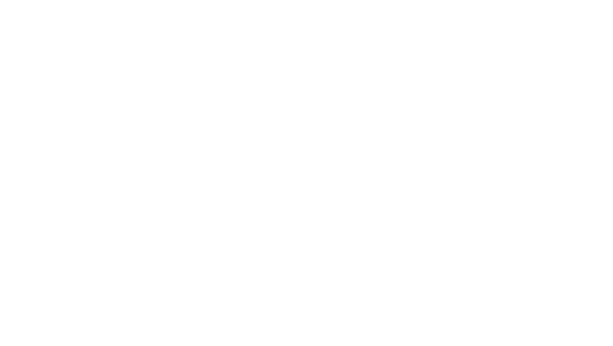

   

    Banner del curso

  
Descripción general del curso, justificación y objetivos

# Contenido

Introducción a los contenidos y relación con las tres secciones principales

## Selección de Materiales Para el Diseño de Componentes

En esta primera sección se explora la seleccion de materiales para el diseño de componentes ya que...

  <table class="table-bordered">
    <tbody>
      <tr>
        <td colspan="2">
          

            Tema
          

        </td>
        <td>
          

            Descripción
          

        </td>
      </tr>
      <tr>
        <td colspan="2">
          Materiales de Ingeniería
        </td>    
        <td>
          Breve descripción de los materiales de ingeniería
        </td>        
      </tr>
      <tr>
        <td colspan="2">
          Selección de Materiales
        </td>
        <td>
          Breve descripción de selección de materiales
        </td>
      </tr>
      <tr>
        <td rowspan="3">
          Caracterización de Materiales
        </td>
        <td>
          Caracterizaciones Magnéticas
        </td>         
        <td>
          Breve descripción de caracterizaciones magnéticas
        </td>       
      </tr> 
      <tr>
        <td>
         Propiedades Ópticas
        </td>
        <td>
          Breve descripción de propiedades ópticas
        </td>         
      </tr>
      <tr>
        <td>
          Resistencia a la Corrosión
        </td>
        <td>
          Breve descripción de resistencia a la corrosión
        </td>          
      </tr>
      <tr>
        <td colspan="2">
          Cartas de Propiedades de los Materiales
        </td>
        <td>
          Breve descripción de cartas
        </td>
      </tr>      
    </tbody>
  </table>

 

## Análisis de Falla

En la segunda sección se aborda el ánalisis de falla como una metodología para...

  <table class="table-bordered">
    <tbody>
      <tr>
        <td colspan="2">
          

            Tema
          

        </td>
        <td>
          

            Descripción
          

        </td>
      </tr>
      <tr>
        <td colspan="2">
          Introducción al Análisis de Falla
        </td>    
        <td>
          Breve descripción del análisis de falla
        </td>        
      </tr>
      <tr>
        <td rowspan="2">
          Modos de Fractura
        </td>
        <td>
          Fracturas por Fatiga
        </td>         
        <td>
          Breve descripción de fracturas por fatiga
        </td>       
      </tr> 
      <tr>
        <td>
         Fracturas por Flexión
        </td>
        <td>
          Breve descripción de fracturas por Flexión
        </td>         
      </tr>
      <tr>
        <td colspan="2">
          Clasificación de Causas que Producen Falla
        </td>
        <td>
          Breve descripción de causas que producen falla
        </td>
      </tr>      
    </tbody>
  </table>

## Ensayos No Destructivos

En la tercera sección se discute la importancia de los ensayos no destructivos al...

  <table class="table-bordered">
    <tbody>
      <tr>
        <td colspan="2">
          

            Tema
          

        </td>
        <td>
          

            Descripción
          

        </td>
      </tr>
      <tr>
        <td colspan="2">
         Funciones y Responsabilidades de un Inspector de Materiales 
        </td>
        <td>
          Breve descripción de funciones y responsabilidades de un inspector de materiales
        </td>        
      </tr>
      <tr>
        <td colspan="2">
         Normatividad Relacionada con END
        </td>
        <td>
          Breve descripción de normatividad relacionada con END
        </td>        
      </tr>
      <tr>
        <td rowspan="6">
          Ensayos No Destructivos
        </td>        
        <td>
         Inspección Visual
        </td>
        <td>
          Breve descripción de inspección visual
        </td>        
      </tr>
      <tr>
        <td>
         Radiografía Industrial
        </td>
        <td>
          Breve descripción de radiografía industrial
        </td>        
      </tr>
      <tr>
        <td>
         Líquidos Penetrantes
        </td>
        <td>
          Breve descripción de líquidos penetrantes
        </td>        
      </tr>
      <tr>
        <td>
         Partículas Magnéticas
        </td>
        <td>
          Breve descripción de partículas mágneticas
        </td>        
      </tr>
      <tr>
        <td>
         Ultrasonido
        </td>
        <td>
          Breve descripción de ultrasonido
        </td>        
      </tr>
      <tr>
        <td>
         Corrientes Inducidas
        </td>
        <td>
          Breve descripción de corrientes inducidas
        </td>        
      </tr>      
    </tbody>
  </table>

# Casos de Estudio

A continuacion se pueden explorar diferentes casos de estudio en los que se evidencia...

##

 Este curso guía ha sido desarrollado con el apoyo de la Escuela Colombiana de Ingeniería - Julio Garavito. Encuentra más contenidos en https://github.com/uescuelaing  

